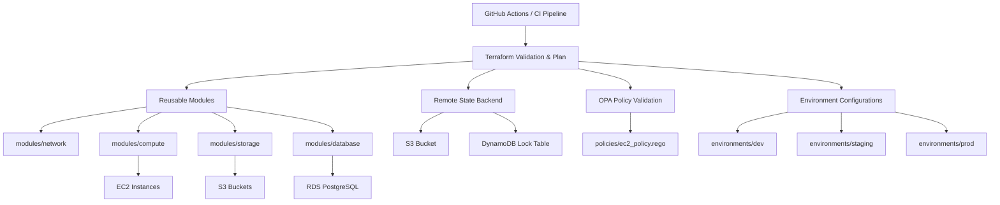

# Enterprise Cloud Foundation

A modular Terraform repository that demonstrates enterprise-style AWS infrastructure using Infrastructure as Code, environment separation, policy-as-code governance, and secure remote state management.

## Project Overview

This repository is organized for clarity, reuse, and DevSecOps alignment.

Key responsibilities:
- Build AWS network, compute, storage, and managed database resources using reusable Terraform modules
- Keep environment-specific configuration separate under `environments/`
- Store Terraform state remotely with S3 and DynamoDB locking
- Enforce infrastructure security rules with Open Policy Agent (OPA)
- Prepare the repo for GitHub Actions-based CI/CD validation

## System Architecture



## Project Structure

```text
enterprise-cloud-foundation-terraform/
├── environments/
│   ├── dev/
│   ├── staging/
│   └── prod/
├── modules/
│   ├── network/
│   ├── compute/
│   ├── storage/
│   └── database/
├── policies/
│   └── ec2_policy.rego
├── scripts/
├── README.md
└── .gitignore
```

## Technologies Used

| Technology              | Purpose                                |
| ----------------------- | -------------------------------------- |
| Terraform               | Infrastructure as Code                 |
| AWS                     | Cloud provider                         |
| Open Policy Agent (OPA) | Policy-as-Code validation              |
| Amazon EC2              | Compute resources                      |
| Amazon S3               | Storage and Terraform backend          |
| Amazon RDS PostgreSQL   | Managed database service               |
| DynamoDB                | Terraform state locking                |

## Security Recommendations

1. Least-Privilege Access
   - Use IAM roles and policies scoped to Terraform and application requirements.
   - Avoid using AWS root account for provisioning.

2. Secure Remote State
   - Store Terraform state in an encrypted S3 bucket.
   - Enable DynamoDB state locking to prevent concurrent state writes.

3. Network Segmentation
   - Keep public and private subnets separate.
   - Use route tables and subnet groups to isolate resources.

4. Access Control
   - Restrict Security Group rules to only required ports and sources.
   - Limit SSH access using CIDR restrictions or bastion hosts.

5. Policy-as-Code Enforcement
   - Run OPA policies against Terraform plan output before apply.
   - Keep policy files versioned in `policies/`.

6. Secrets Management
   - Store AWS credentials and other secrets in GitHub Secrets or AWS Secrets Manager.
   - Do not hardcode sensitive values in Terraform files.

7. CI/CD Validation Gates
   - Validate formatting with `terraform fmt`.
   - Validate configuration with `terraform validate`.
   - Use plan review and policy checks before apply.

8. Monitoring and Auditing
   - Enable AWS logging and monitoring for deployed resources.
   - Audit Terraform plan changes to catch drift and unexpected modifications.

## Deployment Workflow

1. Initialize Terraform
   ```bash
   terraform init
   ```
2. Format source files
   ```bash
   terraform fmt
   ```
3. Validate configuration
   ```bash
   terraform validate
   ```
4. Create a plan
   ```bash
   terraform plan
   ```
5. Apply changes
   ```bash
   terraform apply
   ```

## OPA Policy Validation

Generate a Terraform JSON plan and validate it with OPA:

```bash
terraform plan -out="tfplan.binary"
terraform show -json tfplan.binary > tfplan.json
opa eval --input tfplan.json --data policies/ec2_policy.rego "data.terraform.policies.deny"
```

## Notes

- Keep environment-specific variables and backend configuration isolated under `environments/*`.
- Maintain reusable Terraform modules inside `modules/`.
- Store policy rules in `policies/` and update them as governance needs evolve.

## Author
Atharva Pophali

## License
This project is intended for educational and portfolio purposes.
