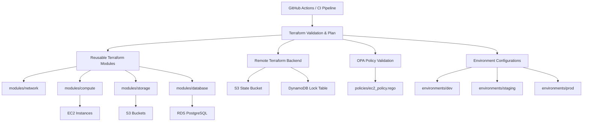

# Enterprise Cloud Foundation using Terraform, AWS, OPA, and GitHub Actions

## Project Overview

This project demonstrates the implementation of an enterprise-style cloud infrastructure platform using Infrastructure as Code (IaC) principles with Terraform on AWS.

The infrastructure includes:

* Networking resources
* Compute infrastructure
* Storage services
* Managed database deployment
* Remote Terraform state management
* Policy-as-Code governance using OPA
* CI/CD automation using GitHub Actions

The goal of this project is to simulate a real-world DevOps/Cloud Engineering environment using modular, reusable, secure, and production-style Terraform architecture.

---

## Technologies Used

| Technology              | Purpose                     |
| ----------------------- | --------------------------- |
| Terraform               | Infrastructure as Code      |
| AWS                     | Cloud Platform              |
| GitHub Actions          | CI/CD Pipeline              |
| Open Policy Agent (OPA) | Policy-as-Code Validation   |
| Amazon EC2              | Compute Resources           |
| Amazon S3               | Storage + Terraform Backend |
| Amazon RDS PostgreSQL   | Managed Database            |
| DynamoDB                | Terraform State Locking     |

---

## System Architecture



---

## Project Architecture

```text
GitHub Actions
       ↓
Terraform CI Pipeline
       ↓
Terraform Modules
       ↓
AWS Infrastructure
│
├── VPC
│   ├── Public Subnets
│   ├── Private Subnets
│   ├── Route Tables
│   └── Internet Gateway
│
├── EC2 Instance
│
├── S3 Bucket
│
├── PostgreSQL RDS
│
└── Remote Terraform Backend
    ├── S3 State Storage
    └── DynamoDB Locking
```

---

## Project Structure

```text
enterprise-cloud-foundation-terraform/
├── environments/
│   ├── dev/
│   ├── staging/
│   └── prod/
│
├── modules/
│   ├── network/
│   ├── compute/
│   ├── storage/
│   └── database/
│
├── policies/
│   ├── ec2_policy.rego
│   └── security_policy.rego
│
├── scripts/
│
├── .github/
│   └── workflows/
│       └── terraform-ci.yml
│
├── README.md
└── .gitignore
```

---

## Features Implemented

### Networking

* Custom VPC creation
* Public and private subnets
* Internet Gateway
* Route Tables
* Route Table Associations

### Compute

* EC2 deployment
* Security Group configuration
* SSH access support

### Storage

* S3 Bucket deployment

### Database

* PostgreSQL RDS deployment
* DB subnet groups
* Database security groups

### Terraform Best Practices

* Modular architecture
* Variables and outputs
* Reusable modules
* Remote state configuration

### Remote State Management

* S3 backend for Terraform state
* DynamoDB state locking

### Policy-as-Code

* OPA governance policies
* EC2 instance type restrictions
* Security validations

### CI/CD

* GitHub Actions workflow
* Terraform validation pipeline
* Automated policy checks

---

## AWS Resources Created

| Resource Type | Resources                          |
| ------------- | ---------------------------------- |
| Networking    | VPC, Subnets, Route Tables         |
| Compute       | EC2 Instance                       |
| Security      | Security Groups                    |
| Storage       | S3 Bucket                          |
| Database      | PostgreSQL RDS                     |
| Backend       | S3 Bucket + DynamoDB Locking Table |

---

## Security Recommendations

### Least-Privilege Access

* Use IAM roles and policies scoped to Terraform and application requirements.
* Avoid using AWS root account for provisioning.

### Secure Remote State

* Store Terraform state in an encrypted S3 bucket.
* Enable DynamoDB state locking to prevent concurrent state writes.

### Network Segmentation

* Keep public and private subnets separate.
* Use route tables and subnet groups to isolate resources.

### Access Control

* Restrict Security Group rules to only required ports and sources.
* Limit SSH access using CIDR restrictions or bastion hosts.

### Policy-as-Code Enforcement

* Run OPA policies against Terraform plan output before apply.
* Keep policy files versioned in `policies/`.

### Secrets Management

* Store AWS credentials and secrets in GitHub Secrets or AWS Secrets Manager.
* Do not hardcode sensitive values in Terraform files.

### CI/CD Validation Gates

* Validate formatting with `terraform fmt`
* Validate configuration with `terraform validate`
* Use plan review and policy checks before apply

### Monitoring and Auditing

* Enable AWS logging and monitoring for deployed resources.
* Audit Terraform plan changes to identify drift and unexpected modifications.

---

## Prerequisites

Before running this project, install:

* Terraform
* AWS CLI
* Git
* OPA
* VS Code (recommended)

---

## AWS Configuration

Configure AWS CLI:

```bash
aws configure
```

Provide:

* AWS Access Key ID
* AWS Secret Access Key
* Region: ap-south-1
* Output format: json

---

## Terraform Backend Configuration

Terraform remote backend uses:

* Amazon S3 for state storage
* DynamoDB for state locking

Example backend configuration:

```hcl
terraform {
  backend "s3" {
    bucket         = "your-terraform-state-bucket"
    key            = "dev/terraform.tfstate"
    region         = "ap-south-1"
    dynamodb_table = "terraform-state-lock"
    encrypt        = true
  }
}
```

---

## Deployment Workflow

### 1. Initialize Terraform

```bash
terraform init
```

### 2. Format Terraform Files

```bash
terraform fmt
```

### 3. Validate Configuration

```bash
terraform validate
```

### 4. Generate Execution Plan

```bash
terraform plan
```

### 5. Deploy Infrastructure

```bash
terraform apply
```

---

## OPA Policy Validation

Generate Terraform plan JSON:

```bash
terraform plan -out="tfplan.binary"
terraform show -json tfplan.binary > tfplan.json
```

Run OPA validation:

```bash
opa eval --input tfplan.json --data ../../policies/ec2_policy.rego "data.terraform.policies.deny"
```

---

## GitHub Actions CI/CD

The CI/CD pipeline automatically performs:

* Terraform initialization
* Terraform formatting checks
* Terraform validation
* Terraform planning
* OPA policy validation

Workflow file:

```text
.github/workflows/terraform-ci.yml
```

---

## Future Enhancements

Potential improvements:

* NAT Gateway integration
* Multi-environment deployment
* Terraform workspaces
* AWS Secrets Manager integration
* CloudWatch monitoring
* Kubernetes/EKS deployment
* Automated Terraform Apply pipeline

---

## Key Learning Outcomes

This project demonstrates practical experience in:

* Infrastructure as Code
* Cloud networking
* AWS resource provisioning
* Terraform modular design
* Remote state management
* DevSecOps practices
* Policy-as-Code implementation
* CI/CD automation

---

## Notes

* Keep environment-specific variables and backend configuration isolated under `environments/*`
* Maintain reusable Terraform modules inside `modules/`
* Store governance policies in `policies/`
* Follow Terraform best practices for scalable infrastructure management

---

## Author

Atharva Pophali

---

## License

This project is intended for educational and portfolio purposes.
